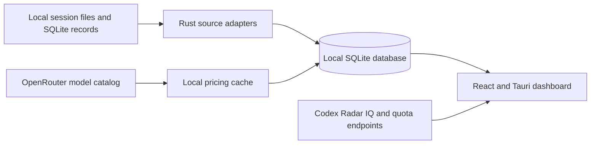

# Usage Beacon

> Local-first AI coding usage observatory for tokens, cost estimates, model pricing, cache efficiency, multi-device history, and quota signals.

Usage Beacon turns the usage records already written by AI coding tools into one searchable desktop workspace. It is built with Tauri, React, TypeScript, Rust, and SQLite, with no required backend account.

## What it answers

- Which tool, provider, model, or computer used the most tokens?
- How are input, output, cached, and reasoning tokens changing over time?
- What is the estimated API cost, and which price source was used?
- Is prompt caching actually reducing the estimated spend?
- What is happening on this computer versus the combined multi-device history?
- What do the Codex Radar IQ and quota panels report right now?

## Highlights

- **One view for multiple coding tools** — Claude Code, Codex CLI, Gemini CLI, OpenCode, ZCode, and Grok Build.
- **Useful analytics** — daily trends, cumulative trends, provider/model breakdowns, cache efficiency, token composition, request details, and paginated logs.
- **Linked filters** — device, source, provider, model, and date filters operate on the same result set.
- **Live pricing with a local cache** — refreshes the public OpenRouter model catalog and keeps the latest usable price locally for consistent calculations.
- **Codex Radar in the dashboard** — IQ metrics and quota radar are displayed in-app instead of opening a separate website.
- **Multi-device history** — export and import usage records as JSON, then switch between this machine and the combined workspace.
- **Light-first desktop UI** — designed for quick scanning without hiding the important numbers in a dark-only interface.

## Supported sources

The importers read usage metadata from local files or databases. They do not need provider API keys.

| Source | Default record location | Notes |
| --- | --- | --- |
| Claude Code | `~/.claude/projects/**/*.jsonl` | Includes nested sub-agent session files. |
| Codex CLI | `~/.codex/sessions` and `~/.codex/archived_sessions` | Override the root with `CODEX_HOME`. |
| Gemini CLI | `~/.gemini/tmp/*/chats/session-*.json` | Reads per-message token counters. |
| OpenCode | `~/.local/share/opencode/opencode.db` | Override with `OPENCODE_DB` or `XDG_DATA_HOME`. |
| ZCode | `~/.zcode/cli/db/db.sqlite` | Reads the `model_usage` table; override with `ZCODE_DB`. |
| Grok Build | `~/.grok/**/updates.jsonl` | Imports completed turn usage after the settle window. |

On Windows, `~` means `%USERPROFILE%`. The application database is stored at:

```text
%APPDATA%\usage-pulse\usage-pulse.db
```

## How it works



Each source is synchronized independently, so a missing or malformed source does not prevent the other sources from being imported. Records are deduplicated before they enter the shared statistics layer.

## Privacy and network behavior

- Usage data is stored locally in SQLite; there is no required Usage Beacon server.
- Importers persist usage metadata such as timestamps, source, model, and token counters—not prompt or response text.
- The app makes optional network requests to refresh OpenRouter prices and retrieve Codex Radar data.
- If a price refresh fails, the existing local cache and bundled fallback prices remain available when possible.
- JSON export is user-initiated. Review an export before sharing it because it can contain aggregate usage, model, device, and project metadata.

## Install on Windows

Download the latest installer from [Releases](../../releases). The app is currently packaged as a Windows desktop application.

## Build from source

### Prerequisites

- Windows 10 or 11 with WebView2
- Node.js 20+
- pnpm
- Rust stable toolchain
- Tauri 2 prerequisites for your platform

### Commands

```bash
pnpm install
pnpm tauri dev
```

Create a production installer and executable:

```bash
pnpm tauri build
```

The release artifacts are written under `src-tauri/target/release/`.

## First run

1. Launch the app and let it discover the local source files.
2. Click **Sync** to import new records.
3. Use the filter matrix to combine device, source, provider, model, and date filters.
4. Choose **This machine** when you only want local history, or the combined view for imported devices.
5. Refresh live pricing when you want to update model prices from OpenRouter.
6. Refresh the Codex Radar panel when you want the latest IQ and quota snapshot.
7. Use JSON export/import to move aggregate usage history between computers.

## Understanding cost estimates

Usage Beacon estimates API cost from token counters and the best matching cached price. It is not a provider invoice: subscription plans, included credits, reseller discounts, routing fees, and provider-specific billing rules may produce a different amount.

The dashboard keeps the price source and refresh time with the model pricing record. A displayed cost of `0` can mean that no matching price was available; it does not necessarily mean that the request used no tokens.

## Development and tests

Run the frontend build and Rust test suite before opening a pull request:

```bash
pnpm build
cargo test --manifest-path src-tauri/Cargo.toml
```

When adding a new source, prefer a small sanitized fixture and a parser test. Never commit real session logs, prompt text, response text, credentials, or exported personal usage data.

## Roadmap

- Add more local coding-agent sources without introducing provider credentials.
- Improve price matching and show clearer provenance for every estimate.
- Add validated transfer backups and conflict-resolution tooling for multi-device imports.
- Publish signed Windows releases and screenshots for the public repository.

## Contributing

Issues and pull requests are welcome. Useful contributions include new source adapters, parser fixtures, pricing tests, accessibility improvements, and chart ideas that answer a concrete usage question.

Before submitting a change:

1. Keep imports local-first and avoid collecting conversation content.
2. Add or update tests for parsing and aggregation behavior.
3. Run `pnpm build` and `cargo test --manifest-path src-tauri/Cargo.toml`.
4. Include a short note about how the change affects cost or token semantics.

## 中文简介

Usage Beacon 是一个本地优先的 AI 编程用量分析桌面工具：把 Claude Code、Codex CLI、Gemini CLI、OpenCode、ZCode、Grok Build 的本地记录统一到一个界面中，查看 token、模型、来源、设备、缓存效率、趋势和费用估算。

它还支持 OpenRouter 价格联网刷新并缓存到本地、Codex Radar 智商与额度雷达、跨电脑 JSON 导入导出，以及“只看本机 / 查看合并数据”的切换。默认浅色界面，所有筛选条件联动，取数和统计仍以本地记录为基础。

费用是估算值，不等同于供应商账单；没有匹配到价格时显示 0 也可能只是“暂无价格”，不代表没有 token 消耗。

## License

The project license has not been selected yet. Add a license file before accepting outside contributions or distributing public releases.
